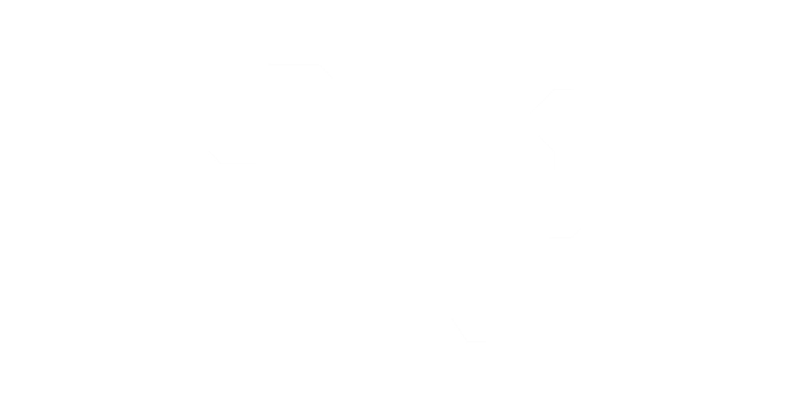
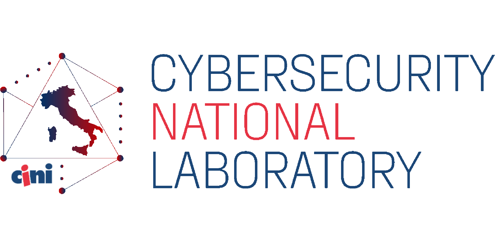
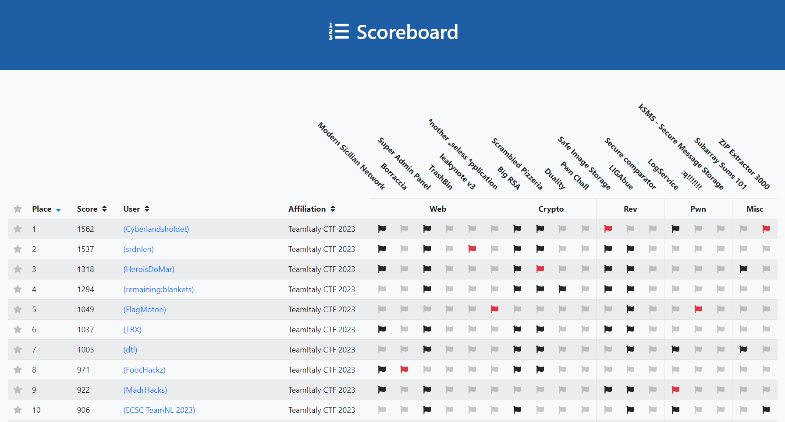

# TeamItalyCTF-2023

TeamItaly CTF 2023 is the second edition of the online Jeopardy-style Capture-The-Flag competition hosted by the members of [TeamItaly](https://teamitaly.eu/), the Italian national cybersecurity team, supported by the italian [Cybersecurity National Laboratory](https://cybersecnatlab.it/) participating in the [European Cyber Security Challenge (ECSC)](https://ecsc.eu/) by [ENISA](https://www.enisa.europa.eu/).

- [CTFtime event](https://ctftime.org/event/2088)
- [CTF Platform](https://ctf.teamitaly.eu/)

   

## Challenges

| Category | Title                                                    | Author                                                | Dynamic            | Type  | Url                                    | Port  |
| :------- | :------------------------------------------------------  | :---------------------------------------------------- | :----------------: | ----: | -------------------------------------: | :---: |
| Web      | [Modern Sicilian Network](ModernSicilianNetwork)         | Leandro Pagano <@Loldemort>                           | :heavy_check_mark: | http  | chat.msn.challs.teamitaly.eu           | 80    |
| Web      | [Borraccia](Borraccia)                                   | Salvatore Abello <@salvatore.abello>                  | :heavy_check_mark: | http  | borraccia.challs.teamitaly.eu          | 80    |
| Web      | [Super Admin Panel](SuperAdminPanel)                     | Jacopo Di Pumpo <@shishcat>                           | :heavy_check_mark: | tcp   | superadminpanel.challs.teamitaly.eu    | 80    |
| Web      | [TrashBin](TrashBin)                                     | Lorenzo Leonardini <@pianka>                          | :heavy_check_mark: | http  | trashbin.challs.teamitaly.eu           | 80    |
| Web      | [leakynote v3](leakynotev3)                              | Alessandro Mizzaro <@Alemmi>, Stefano Alberto <@Xato> | :heavy_check_mark: | http  | leakynote.challs.teamitaly.eu          | 80    |
| Web      | [ᴬnother ᵤseless ᴬpplication](AnotherUselessApplication) | Alessandro Mizzaro <@Alemmi>, Stefano Alberto <@Xato> | :heavy_check_mark: | http  | site.aua.challs.teamitaly.eu           | 80    |
| Crypto   | [Big RSA](BigRSA)                                        | Antonio Angelo Polignano <@Poli>                      | :x:                |       |                                        |       |
| Crypto   | [Scrambled Pizzeria](ScrambledPizzeria)                  | Mattia Lorenzo Chiabrando <@mattia>                   | :heavy_check_mark: | tcp   | scrambledpizzeria.challs.teamitaly.eu  | 29002 |
| Crypto   | [Duality](Duality)                                       | Gennaro Pierro <@Genni>                               | :x:                |       |                                        |       |
| Crypto   | [Pwn Chall](PwnChall)                                    | Lorenzo Demeio <@Devrar>                              | :heavy_check_mark: | tcp   | pwnchall.challs.teamitaly.eu           | 29000 |
| Rev      | [Safe Image Storage](SafeImageStorage)                   | Gianluca Altomani <@devgianlu>                        | :heavy_check_mark: | http  | safeimagestorage.challs.teamitaly.eu   | 80    |
| Rev      | [LIGAbue](LIGAbue)                                       | Carlo Collodel <@collodel>                            | :x:                |       |                                        |       |
| Rev      | [Secure comparator](Securecomparator)                    | Dario Petrillo <@dp_1>, Giulia Aloia <@daisy>         | :x:                |       |                                        |       |
| Pwn      | [LogService](LogService)                                 | Riccardo Sulis <@ricchi24>                            | :heavy_check_mark: | tcp   | log.challs.teamitaly.eu                | 29006 |
| Pwn      | [:q!!!!!!!](colon-q-exclamation-mark)                     | Marco Meinardi <@Chino>                               | :heavy_check_mark: | tcp   | vim9.challs.teamitaly.eu               | 29004 |
| Pwn      | [kSMS - Secure Message Storage](kSMS)                    | Vincenzo Bonforte <@Bonfee>                           | :heavy_check_mark: | tcp   | ksms.challs.teamitaly.eu               | 29003 |
| Misc     | [Subarray Sums 101](SubarraySums101)                     | Carmen Casulli <@Dandelion>, Lorenzo Demeio <@Devrar> | :heavy_check_mark: | tcp   | subarraysums101.challs.teamitaly.eu    | 29001 |
| Misc     | [ZIP Extractor 3000](ZIPExtractor3000)                   | Giovanni Minotti <@Giotino>                           | :heavy_check_mark: | http  | zip-extractor-3000.challs.teamitaly.eu | 80    |

## Final scoreboard

### Top 10

### Full scoreboard

- [Full scoreboard](images/scoreboard-full.png)
- [Solves](images/solves.png)

### Data export

- [Scoreboard feed (CTFTime format)](data/scoreboard.json)
- [Scoreboard feed (csv)](data/scoreboard.csv)
- [Correct submissions (csv)](data/submissions.csv)
