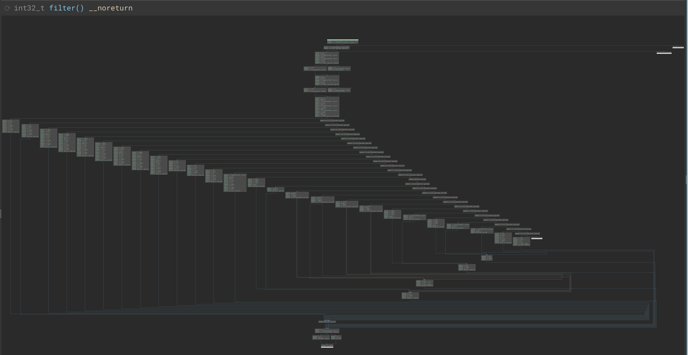

# TeamItalyCTF 2023

## [rev] Secure comparator (1 solve)
My Italian friend just discovered a new way to compute securely!! Can you guess what the secret advice is?

Authors: Dario Petrillo <@dp_1>, Giulia Aloia <@daisy>

## Setup

The challenge is made of two files, `secure_comparator` and `checker.bin`. Running the first without any arguments shows its intended usage:

```
$ ./secure_comparator
Usage: ./secure_comparator checker.bin
```

Let's do just that, and it looks like the classic "crackme" flag checker (With a progress bar! That took too much time not to mention it):

```
SECure COMParator v0.2
>>> flag{test}
[===============================================================]
Skill issue
Halted.
```

## Initial exploration

`strings secure_comparator` gives some initial insights on what the challenge might be, with references to seccomp and some kind of cpu:

```
$ strings secure_comparator
[...]
Halted.
main.c
false && "Device not found"
Can't open program file
Reading code failed
Reading data failed
Reading call table failed
PR_SET_NO_NEW_PRIVS
PR_SET_SECCOMP
Usage: %s checker.bin
cpu_get_device
```

We can't find `SECure COMParator v0.2` and the rest of the program output, which are instead in checker.bin:

```
$ strings checker.bin
SECure COMParator v0.2
>>>
Looks like a flag!
Go and submit it
Skill issue
 I'p
 !"#$%&'()*+,-./0123456789:;<=>?@ABCDEFGHIJKLMNOPQRSTUVWXYZ[\]^_`abcdefghijklmnopqrstuvwxyz{|}~
```

At this point you probably tried to look for side channels, and I really hope I didn't leave any. If you did find one, let us know!

Let's jump into IDA, and look at this binary in more detail.

## Actual reversing

At a high level, the binary does the following:

- Load a [Seccomp filter](https://docs.kernel.org/userspace-api/seccomp_filter.html), which we will analyze in a bit;
- Perform some initialization on a pretty bit `calloc`-ed chunk of memory;
- Load the `checker.bin` file, with some nice error messages for us to use;
- Run `sub_16B0` in a loop.

Given the error messages in `sub_15C0`, we can guess this is some sort of CPU. After renaming things a bit, and defining a Cpu structure, `main` looks something like this:

```c
__int64 __fastcall main(__int64 argc, char **argv, char **envp)
{
  int v3;
  Cpu *cpu;

  v3 = argc;
  load_seccomp_filter();
  cpu = (Cpu *)calloc(1uLL, 0x8420uLL);
  cpu->running = 1;

  some_pointer_stuff(cpu, off_4BA0);
  some_pointer_stuff(cpu, qword_4BC0);
  some_pointer_stuff(cpu, qword_4B80);

  if ( v3 <= 1 )
  {
    __fprintf_chk(stderr, 1LL, "Usage: %s checker.bin\n", *argv);
    exit(1);
  }
  load_program(cpu, argv[1]);

  while ( cpu->running )
    cpu_step(cpu);

  free(cpu);
  return 0LL;
}
```

`load_program` (what was `sub_15C0` before) helps in recostructing what the `Cpu` struct should look like, and at this point it should be something like:

```
00000000 Cpu             struc ; (sizeof=0x841C, mappedto_8)
00000000 field_0         dq ?
00000008 field_8         dq ?
00000010 field_10        dq ?
00000018 running         db ?
00000019                 db ? ; undefined
0000001A                 db ? ; undefined
0000001B                 db ? ; undefined
0000001C code            db 16384 dup(?)
0000401C data            db 16384 dup(?)
0000801C call_table      db 1024 dup(?)
0000841C Cpu             ends
0000841C
```

Most of the stuff is there, we are just missing a meaning for the first few bytes.

`cpu_step` is going to be our next target. It first performs two raw syscalls to SYS_sendto, passing some state from the `cpu` instance as its arguments. It then combines the `errno` value it gets from both, and interprets it as some sort of command.

At this point, the start of `Cpu` should look like this:
```
00000000 Cpu             struc ; (sizeof=0x841C, mappedto_8)
00000000 field_0         dq ?
00000008 field_8         dw ?
0000000A field_A         dw ?
0000000C field_C         dw ?
0000000E                 db ? ; undefined
0000000F                 db ? ; undefined
00000010 field_10        dq ?
00000018 running         db ?
```

The first two bits of the value it gets from errno mark the four major operations it handles. "opcode" 00 is the most complex, with a sub-operation encoded in the next three bits, while opcodes 01, 10, 11 simply set one of the three 16-bit variables contained in `Cpu` (`field_8`, `field_A`, and `field_C`, maybe some registers?).

While it's not clear yet how these errno values are generated, it's worth it to continue reversing this function, and especially the suboperations of opcode 00. Let's see the suboperations:

- 0 and 1 both call `sub_1530`, passing it the next three bits of the result, and a value. For 0, the value is the lowest byte of the result, while for 1 it comes from memory. A good guess here is that it is setting some register, either with a constant or loading from some address.
    - Of note is `field_8`, one of the 16 bit registers that we mentioned before which is only ever used as a memory address, once in operation 1 and once in operation 2. Looks like a [Memory address register](https://web.archive.org/web/20170328171842/http://www.cs.umd.edu/class/sum2003/cmsc311/Notes/Overall/mar.html), let's rename it as such.
    - `sub_1530` (and its companion `sub_1510`) should be setting and getting the value of a register, if our guess is right. Indeed, the first is setting a single byte in `field_0`, while the latter is getting a specific byte from it:

    ```c
    __int64 __fastcall sub_1530(Cpu *cpu, char a2, unsigned __int8 a3)
    {
    __int64 result; // rax

    result = ((unsigned __int64)a3 << (8 * a2)) | cpu->field_0 & ~(255LL << (8 * a2));
    cpu->field_0 = result;
    return result;
    }
    unsigned __int64 __fastcall sub_1510(Cpu *cpu, char a2)
    {
    return (unsigned __int64)cpu->field_0 >> (8 * a2);
    }
    ```
    Looks like this is an 8 bit cpu, with up to 8 registers (but what about the bigger registers we saw before?). Let's rename them and `field_0` accordingly.
- We saw 2 before, it's storing something in memory.
- 3 is the only one referencing the `call_table`, and it behaves like a call should: it stores the program counter (`field_A`) in memory, decrements a stack pointer (`field_C`), and changes the program counter to some other value. Somehow, calls must be indirect, with the instruction only containing an index into che call table, which stores the actual addresses. This makes sense, as so far the best guess is 8 bit registers, but a 16 bit address bus.
- 4 and 5 look pretty similar, they both get a pointer from `sub_1570` (which, from its error message, is now `cpu_get_device`), and call a function pointer stored in the resulting struct. (Remember the three structs passed to `some_pointer_stuff`?)
- 6 is a nop
- finally, 7 reads two bytes from memory, sets `pc` to their concatenation and increases the stack pointer by two. Looks like a `ret`.

`cpu_get_device` also shows that the devices are kept in a linked list:
```c
Device *__fastcall cpu_get_device(Cpu *cpu, int a2)
{
  Device *result; // rax

  result = cpu->devices;
  if ( !result )
LABEL_6:
    __assert_fail("false && \"Device not found\"", "main.c", 0x58u, "cpu_get_device");
  while ( result->id != a2 )
  {
    result = result->next;
    if ( !result )
      goto LABEL_6;
  }
  return result;
}
```

So our structs should now look like this:
```
00000000 Cpu             struc ; (sizeof=0x841C, mappedto_8)
00000000 registers       dq ?
00000008 mar             dw ?
0000000A pc              dw ?
0000000C stack_pointer   dw ?
0000000E                 db ? ; undefined
0000000F                 db ? ; undefined
00000010 devices         dq ?                    ; offset
00000018 running         db ?
00000019                 db ? ; undefined
0000001A                 db ? ; undefined
0000001B                 db ? ; undefined
0000001C code            dd 4096 dup(?)
0000401C data            db 16384 dup(?)
0000801C call_table      dd 256 dup(?)
0000841C Cpu             ends
0000841C
00000000 ; ---------------------------------------------------------------------------
00000000
00000000 Device          struc ; (sizeof=0x20, mappedto_9)
00000000 next            dq ?                    ; offset
00000008 id              db ?
00000009                 db ? ; undefined
0000000A                 db ? ; undefined
0000000B                 db ? ; undefined
0000000C                 db ? ; undefined
0000000D                 db ? ; undefined
0000000E                 db ? ; undefined
0000000F                 db ? ; undefined
00000010 read_byte       dq ?                    ; offset
00000018 write_byte      dq ?                    ; offset
00000020 Device          ends
```

with `read_byte` and `write_byte` in `Device` being the two function pointers called by suboperations 4 and 5.

To complete this part, let's look at the devices that get registered at the start. `some_pointer_stuff` is now `register_device`, and it links the given device at the start of the linked list:
```c
void __fastcall register_device(Cpu *cpu, Device *dev)
{
  dev->next = cpu->devices;
  cpu->devices = dev;
}
```

And after some renaming the devices can look like this:
```
.data:0000000000004B80 ; Device device_42
.data:0000000000004B80 device_42       dq 0                    ; next
.data:0000000000004B80                                         ; DATA XREF: main+46↑o
.data:0000000000004B88                 db 2Ah                  ; id
.data:0000000000004B89                 db 7 dup(0)
.data:0000000000004B90                 dq offset dev_42_read   ; read_byte
.data:0000000000004B98                 dq offset dev_42_write  ; write_byte
.data:0000000000004BA0 ; Device device_128
.data:0000000000004BA0 device_128      dq 0                    ; next
.data:0000000000004BA0                                         ; DATA XREF: main+24↑o
.data:0000000000004BA8                 db 80h                  ; id
.data:0000000000004BA9                 db 7 dup(0)
.data:0000000000004BB0                 dq offset dev_128_read  ; read_byte
.data:0000000000004BB8                 dq 0                    ; write_byte
.data:0000000000004BC0 ; Device device_127
.data:0000000000004BC0 device_127      dq 0                    ; next
.data:0000000000004BC0                                         ; DATA XREF: main+3A↑o
.data:0000000000004BC8                 db 7Fh                  ; id
.data:0000000000004BC9                 db 7 dup(0)
.data:0000000000004BD0                 dq 0                    ; read_byte
.data:0000000000004BD8                 dq offset dev_127_write ; write_byte
```

## x86 is boring

We looked at everything in the binary, except for the seccomp filter. Let's dump it:

```
$ seccomp-tools dump ./secure_comparator
 line  CODE  JT   JF      K
=================================
 0000: 0x20 0x00 0x00 0x00000004  A = arch
 0001: 0x15 0x00 0x02 0xc000003e  if (A != ARCH_X86_64) goto 0004
 0002: 0x20 0x00 0x00 0x00000000  A = sys_number
 0003: 0x15 0x02 0x01 0x0000002c  if (A == sendto) goto 0006 else goto 000
[...]
 0357: 0x74 0x00 0x00 0x00000008  A >>= 8
 0358: 0x54 0x00 0x00 0x000000ff  A &= 0xff
 0359: 0x44 0x00 0x00 0x00050000  A |= 0x50000
 0360: 0x16 0x00 0x00 0x00000000  return A
```

It's pretty long, and it definitely doesn't look like your classical syscall filter. It only handles `sendto`, the same syscall we were using before - that's promising.

> Fun fact: this challenge almost didn't happen. See that `A |= 0x50000` at the very end? It's effectively doing a `return ERRNO(A)`, but the `seccomp-tools` assembler doesn't recognize that, and the seccomp documentation doesn't mention it as a possibility either. Very understandable, you usually return some constant value for `errno`, and not the result of a calculation. But if you have a look at [seccomp.c](https://elixir.bootlin.com/linux/v6.5.4/source/kernel/seccomp.c#L1212) you can see that the returned `action` is taken from the high 16 bits of the return code, and 0x50000 corresponds to `SECCOMP_RET_ERRNO`.

The filter is made up by 3 parts: it first decodes the instruction, then "executes" it generating the commands that we reversed before, and at the very end it chooses which byte to send out as `errno`.



> Bird's eye view of the filter, as output from [my seccomp binaryninja plugin](https://github.com/dp1/bn-seccomp), which will hopefully be free enough of bugs by the time this writeup comes out to be published. It's definitely not needed for this challenge, but was fun to write.

The first section of the filter (up to instruction 0050) functions as an instruction decoder, and parses the opcode (passed as fifth argument) into its fields, stored as `mem[0]`...`mem[5]`:

```
 31      17   14    11    8    0
 | imm14 | rd | rs2 | rs1 | op |
    |imm8|
    23
```

The `rs1` and `rs2` filters have a more complex handling, where the filter extracts the corresponding register value and stores that in memory instead of the raw index found in the instruction. This is the `rs1` decoder, it takes the registers as the first argument and select the byte indexed by the `rs1` field.
```
 0011: 0x20 0x00 0x00 0x00000030  A = addr # sendto(fd, buff, len, flags, addr, addrlen)
 0012: 0x74 0x00 0x00 0x00000008  A >>= 8
 0013: 0x54 0x00 0x00 0x00000007  A &= 0x7
 0014: 0x24 0x00 0x00 0x00000008  A *= 0x8
 0015: 0x35 0x03 0x00 0x00000020  if (A >= 32) goto 0019
 0016: 0x07 0x00 0x00 0x00000000  X = A
 0017: 0x20 0x00 0x00 0x00000010  A = fd # sendto(fd, buff, len, flags, addr, addrlen)
 0018: 0x05 0x00 0x00 0x00000003  goto 0022
 0019: 0x14 0x00 0x00 0x00000020  A -= 0x20
 0020: 0x07 0x00 0x00 0x00000000  X = A
 0021: 0x20 0x00 0x00 0x00000014  A = fd >> 32 # sendto(fd, buff, len, flags, addr, addrlen)
 0022: 0x7c 0x00 0x00 0x00000000  A >>= X
 0023: 0x54 0x00 0x00 0x000000ff  A &= 0xff
 0024: 0x02 0x00 0x00 0x00000001  mem[1] = A
```

Then each instruction is handled, and finally the filter chooses one of two bytes to output based on the sixth argument. This is needed because errno can only go up to 4096, while the filter needs to output a full 16 bits.

```
 0351: 0x20 0x00 0x00 0x00000038  A = addrlen # sendto(fd, buff, len, flags, addr, addrlen)
 0352: 0x15 0x00 0x03 0x00000000  if (A != 0x0) goto 0356
 0353: 0x87 0x00 0x00 0x00000000  A = X
 0354: 0x54 0x00 0x00 0x000000ff  A &= 0xff
 0355: 0x05 0x00 0x00 0x00000003  goto 0359
 0356: 0x87 0x00 0x00 0x00000000  A = X
 0357: 0x74 0x00 0x00 0x00000008  A >>= 8
 0358: 0x54 0x00 0x00 0x000000ff  A &= 0xff
 0359: 0x44 0x00 0x00 0x00050000  A |= 0x50000
 0360: 0x16 0x00 0x00 0x00000000  return A
```

Mapping the output of each instruction with its interpretation in `cpu_step` we can decode the instructions as:

|opcode|name|description|
|-|-|-|
|1|set|`rd = imm8`|
|2-8|alu|`rd = rs1 <alu_operation> rs2`|
|9|load|`rd = mem[mar]`|
|10|store|`mem[mar] = rs1`|
|11|in|`rd = read_byte_from_device(id: imm8)`|
|12|out|`write_byte_to_device(id: imm8, source: rs1)`|
|13-18|jumps|conditional and unconditional jumps, the target address is always imm14|
|19|load_mar|`mar = concat(rs1, rs2)`|
|24|call|`call call_table[imm8]`|
|25|ret|well, `ret`|

I only included some of the instructions used in the challenge, see `arch.h` and `filter.bpf` in the source for all the details.

## ~~x86 is boring~~ seccomp is boring

Time to reverse `checker.bin`, shall we?

Here, depending on how much info you got from the previous parts, you should be able to write some form of a disassembler. A simple, but working disassembler is [here](writeup/disassembler.py), and its output is [here](writeup/disasm.asm), with some annotations.

I split the assembly code in functions, by seeing which instructions were targets of a `call`. The entry point is at address 0 (`cpu` comes from a `calloc`, so `pc == 0` at startup).

`output_string` and `input_string` are the shortest and don't call anything else, so reversing should probably start from those (of course, you'd get the names after reversing them). `main` calls most of the other functions, then based on the value stored at address `0x440` prints one of two strings, so `0x440` most likely marks whether the input is correct. The big remaining functions implement the rest of the crackme: `init_something` is called before user input, while `work_with_input`, well, does something with the user input.
`compare_char` looks complex, but the important code is all at the start, where it sets `0x440` to 1 if its two inputs (`r4` and `r5`) differ. The rest of it is a delay loop with code to display the progress bar; we can ignore it.

## crypto?
> kinda

Let's look at `init_something` in more detail. Here is an annotated version of it:

```
init_something:
0090: r0 = 10 # data1 starts at 0x1000
0094: r1 = 7  # data2 starts at 0x700
0098: r2 = 0
009c: r3 = 0
00a0:   mar = r0 || r2
00a4:   r5 = mem[mar]   # r5 = data1[r2]
00a8:   r7 = f
00ac:   r7 = r2 & r7
00b0:   mar = r1 || r7
00b4:   r6 = mem[mar]   # r6 = data2[r2 % 0x0f]
00b8:   r3 = r3 + r5
00bc:   r3 = r3 + r6    # r3 = r3 + r5 + r6
00c0:   mar = r0 || r2
00c4:   r5 = mem[mar]
00c8:   mar = r0 || r3
00cc:   r6 = mem[mar]
00d0:   mar = r0 || r2
00d4:   mem[mar] = r6
00d8:   mar = r0 || r3
00dc:   mem[mar] = r5  # swap data1[r2], data1[r3]
00e0:   r7 = 1
00e4:   r2 = r2 + r7   # r2++
00e8:   r7 = 0
00ec:   if r2 != r7: goto 00a0
00f0: ret
```

If you recognize this as the [RC4 key scheduling](https://en.wikipedia.org/wiki/RC4#Key-scheduling_algorithm_(KSA)), you can probably guess what `work_with_input` does, and invert it to get the flag. Otherwise, let's keep reversing.

```
work_with_input:
# main sets r0:r1 to the address of our input before calling this function
00f4: r3 = 10    # data1 starts at 0x1000
00f8: r4 = 0
00fc: r5 = 0
0100:   r7 = 1
0104:   r4 = r4 + r7    # r4++
0108:   mar = r3 || r4
010c:   r6 = mem[mar]
0110:   r5 = r5 + r6    # r5 += data1[r4]
0114:   mar = r3 || r4
0118:   r6 = mem[mar]
011c:   mar = r3 || r5
0120:   r7 = mem[mar]
0124:   mar = r3 || r4
0128:   mem[mar] = r7
012c:   mar = r3 || r5
0130:   mem[mar] = r6   # swap data1[r4], data1[r5]
0134:   r6 = r6 + r7
0138:   mar = r3 || r6
013c:   r6 = mem[mar]   # r6 = data1[data1[r4] + data1[r5]]
0140:   mar = r0 || r1
0144:   r7 = mem[mar]
0148:   r7 = r6 ^ r7
014c:   mem[mar] = r7   # *input++ ^= r6
0150:   r7 = 1
0154:   r1 = r1 + r7
0158:   r2 = r2 - r7
015c:   r7 = 0
0160:   if r2 != r7: goto 0100
0164: ret
```

This is, once again, RC4. If you recognize it, you can take the key from memory (stored at address 0x700) and decrypt with python:

```python
import sys, random
from Crypto.Cipher import ARC4

rc4_key = bytes([157, 121, 177, 163, 127, 49, 128, 28, 209, 26, 103, 6, 251, 64, 214, 189])
enc_flag = bytes([32, 73, 39, 112, 140, 234, 6, 196, 10, 148, 154, 143, 41, 74, 203, 217, 7, 155, 212, 127, 181, 42, 2, 49, 8, 6, 176, 130, 68, 133, 171, 218, 240, 224, 247, 94, 140, 190, 230, 23, 246, 238, 206, 191, 102, 193, 221, 101, 172, 156, 254, 139, 176, 99, 151, 238, 171, 69, 184, 195, 167, 112, 207, 30])

flag = ARC4.new(rc4_key).decrypt(enc_flag)
print(bytes(flag))
```

Otherwise, you can see that `work_with_input` doesn't do anything with our input other than xor-ing it with the bytes it generates, so you can repeat the process and get the flag.
