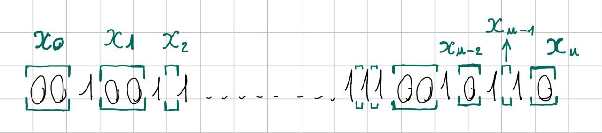

# TeamItaly CTF 2023

## [crypto] Subarray sums 101 (8 solves)
Just a simple query challenge, but can you solve it in time?  

This is a remote challenge, you can connect with:  

`nc subarraysums101.challs.teamitaly.eu 29001`  

Authors: Carmen Casulli <@Dandelion>, Lorenzo Demeio <@Devrar>

## Overview

In this challenge the server generates a secret as an array of $0$ and $1$ and precomputes the number of occurences of all the sums of its subarrays, which are stored in the dictionary 'query_results'. The program then lets the user perform $\frac{n}{2}$ queries over this dictionary and asks them to guess the secret. If the user guesses correctly, the server will send them the flag.
The server also sets a timeout of $20$ seconds to add a time constraint to the challenge (and to avoid hanging connections).

## Solution

### Determining the number of 1s in the secret
Let $u$ be the number of $1$ that appear in the secret.
- **First observation:** $u$ is the greatest positive number such that its query result $q_u$ will be positive while $q_{u+1}$ will be $0$, therefore we could find $u$ with a binary search or also by just asking for all query results from $1$ to $n$, until we find the value with the aforementioned property.
- **Second observation:** After we've found $u$, we can get information on the secret from at most $u+1$ queries (from $q_0$ to $q_u$), as we already know that the result for any query $q_x$ with $x>u$ will be $0$.
- **Third observation:** The number of $0$ and $1$ in the sequence will be approximately $\frac{n}{2}$ which is also the number of queries we can perform; therefore we will assume $u \lt \frac{n}{2}$, start asking for all queries from $q_1$ until we find $q_x \gt 0$ and $q_{x+1} = 0$ (which lets us deduce $U=x$), and store their results.

If the assumption of the third observation doesn't hold, we will reach the maximum number of queries before we encounter $u$. If this case occurs we shall simply close this connection with the server and open a new one.
Notice also that we have not asked for $q_0$, and we will soon see why.


```python
def getU():
    u = 0
    while(u<n):
        if num_queries == n//2:
            return -1
        if(get_query(u+1) == 0):
            break
        u += 1
    return u
```


### Writing a system of equations
We now define $u+1$ variables that shall represent the number and disposition of $0$ that appear in the secret.
<br/>Let $x_i$ for $i = 0, 1, 2, ... u$ be defined as follows:

```math
x_i :=
\begin{cases}
\text{the number of $0$ before the first $1$} & \quad \text{when $i = 0$}\\
\text{the number of $0$ after the last $1$} & \quad \text{when $i = u$}\\
\text{the number of $0$ between the $i$-th $1$ and the following one} & \quad \text{otherwise}
\end{cases}
```

<p align="center">

</p>


Notice that some $x_i$ can also be $0$, which means that the $i$-th $1$ is directly followed by another $1$ in the secret (or that the secret starts/ends with $1$ if $i = 0$ or $i = u$).


#### First equation
Let $z$ be the number of $0$ in the secrets.
- **First observation:** $z + u = n$.
- **Second observation:** $z = {\sum}_{i=0}^u x_i$
<br/>Thus we have our first equation in the variables $x_i$:
```math
\sum_{i=0}^{u} x_i = n - u
```


#### Query equations
We can now observe that all query results can be written as equations in these variables, take as an example $q_u$:
we can only get $u$ as sum of a subarray if it includes all 1s of the secret, therefore its starting point $a$ should between $0$ and $x_0$, while its ending point $b$ should be between $n-1-x_u$ and $n-1$, since including one or more 0s won't change the result. This means that the total number of subarray that yield this sum is: $\ (x_0+1) \cdot (x_u+1) = q_u$ .

Similarly, to get $u-1$ as subarray sum, we must include all 1s in our subarray except for 1: this can be the first $1$ of the secret, in which case we will have $(x_1 + 1) \cdot (x_u + 1)$ possibilities, or the last one, which gives us $(x_0 + 1) \cdot (x_{u-1} + 1)$ other possibilities. The total will therefore be: $\ (x_1 + 1) \cdot (x_u + 1) + (x_0 + 1) \cdot (x_{u-1} + 1) = q_{u-1}$

In the general case, for $0 \leq k \lt u$, to get $u-k$ as subarray sum, we must consider all subarrays that include exactly $u-k$ $1$ and as many $0$ as we want; if we fix the first $1$ of this subarray, say the $i$-th one in the secrets, the number of such subarrays will be: $(x_i + 1) \cdot (x_{u-k+1} + 1)$. Therefore if we sum all of this we get:
```math
\sum_{i=0}^{k}  (x_i + 1) \cdot (x_{u-k+1} + 1)  =   q_{u-k}
```

We don't like all those $+ 1$ lying around, so we'll just define new variables $y_i = x_i + 1$ for $i = 1, 2, ... u$ and rewrite our system of equations in term of those:
```math
\begin{cases}
\ {\sum}_{i=0}^{k} \ y_i \cdot y_{u-k+1}  =   q_{u-k} & \quad 0 \leq k \lt u
\end{cases}
```

Let us also rewrite the first equation we had:
```math
\begin{align*}
n - u = \sum_{i=0}^{u} x_i &= \sum_{i=0}^{u} {(y_i - 1)} = \sum_{i=0}^{u} {y_i} - (u+1)
\\  \implies   \sum_{i=0}^{u} {y_i} &= n - u + (u+1) = n + 1
\end{align*}
```

Therefore our complete system is:
```math
\begin{cases}
{\sum}_{i=0}^{u} \ {y_i} = n + 1 \\
{\sum}_{i=0}^{k} \  y_i \cdot y_{u-k+1}  =   q_{u-k} & \quad 0 \leq k \lt u
\end{cases}
```


#### Unused query
As we've already mentioned, the query $q_0$ is never used, not even in the system of equations. This is because the information it provides is redundant: in order to get subarray sum $0$, we must include only zeroes in our subarray, which means it must lie either entirely in the first $x_0$ zeroes of the secret, in the last $x_u$ or between the $i$-th $1$ and the following one, for some $i = 1 ... u-1$. If we fix $i$ (also including the edge cases $i=0$ and $i=u$), the number of such subarrays is $\frac{x_i \cdot (x_i+1)}{2} = \frac{(y_i - 1) \cdot y_i}{2} = \frac{y_i^2 - y_i}{2}$; thus we get:
```math
q_0 = \frac{1}{2} \cdot \sum_{i=0}^{u} {y_i^2 - y_i}
```

This information is redundant because we already know $\Sigma_{i=0}^{u} {y_i} = n + 1$ and the sum of all products $y_i \cdot y_j, \ i \neq j$, that is: $\Sigma_{k=0}^{u-1} q_{u-k}$.
From this we can derive:
```math
\begin{align*}
& (n+1)^2 - 2 \cdot \sum_{k=0}^{u-1} (q_{u-k}) = \left(\sum_{i=0}^{u} {y_i}\right)^2 - \sum_{\substack{0 \leq i,j \leq u, \\ i \neq j}} {y_i \cdot y_j} = \sum_{i=0}^{u} {y_i^2}
\\ \implies
q_0 &= \frac{1}{2} \cdot \sum_{i=0}^{u} {y_i^2 - y_i} = \frac{1}{2} \cdot \left(\sum_{i=0}^{u} {y_i^2} - \sum_{i=0}^{u} {y_i}\right)   =   \frac{1}{2} \cdot \left((n+1)^2 - 2 \cdot \sum_{k=0}^{u-1} (q_{u-k}) - (n+1)\right)  =   \frac{n \cdot (n+1)}{2} - \sum_{k=0}^{u-1} (q_{u-k})
\\ \implies
q_0 &= \frac{n \cdot (n+1)}{2} - \sum_{k=0}^{u-1} (q_{u-k})
\end{align*}
```

Now give the system to your favorite SMT solver and you'll get the solution - but watch out for the time limit (later in [Implementation](#implementation)).


### Limitations
The values of $y_i$ that corresponde to the secret won't be the only solution to the system, for example the inverse/symmetric sequence of the secret will yield the exact same set of subarray sums with the same number of occurrences. The server grants us only one attempt at guessing the secret per connection, therefore if we don't get the right one we will simply connect again and retry.


### Reconstructing the secret
To reconstruct the secret we shall first write $x_0 = y_0 - 1$ zeroes, then for $i = 1 ... u$ we will append $1$ one and $x_i = y_i - 1$ zeroes to it.

```python
# assuming the array result contains y_i
maybeRes = [0]*(result[0]-1)
for i in range(1, u+1):
    maybeRes += [1] + [0]*(result[i]-1)
```


## Implementation

Let's discuss a few implementation details of the solution we have proposed.
First of all, the choice of the solver. The system of equations can be solved by any generic SMT solver, but most won't do it within the time limit given the set of constraints. For this purpose we've decided to use [cvc5](https://cvc5.github.io/), whose python API have the same syntax as Z3's. We have also tried using Z3, but it was too slow.
<br/>For some instancies of the secret the solver was still taking too long, so we also set its time limit to $20$ seconds with ```setOption("tlimit-per", 20000)``` and we added the assumption that all $y_i$ must be less than $10$, which clearly implies that our solver won't always find the correct answer and that sometimes it won't find an answer at all.

To cover all these situation, our code must connect to the server multiple times, until it finds a secret that satisfies all assumptions that we have made, that must be solvable by cvc5 within the time limit, plus we need to be lucky enough to get the correct solutions, and not its inverse.

Checking that $u \lt \frac{n}{2}$ is rather quick, while running the solver can be rather slow, sometimes il will use all the 20 seconds up without producing a solution and on other times it will give us the inverse of the secret, though in most cases it takes less than $10$ seconds to solve the system, so in a couple of minutes it shall be done.


Here is the complete code of the solution:

```python
from pwn import remote, process
from cvc5 import *
from cvc5.pythonic import *
import os

online = True

n = 128
queries_ans = [-1]*(n+1)
num_queries = 0

HOST = os.environ.get("HOST", "todo.challs.todo.it")
PORT = int(os.environ.get("PORT", 34001))

def initConn():
    global io, num_queries
    io = remote(HOST, PORT)

def get_query(k):
    global num_queries
    if(queries_ans[k] == -1):
        io.sendlineafter(b'> ', str(k).encode())
        queries_ans[k] = int(io.recvline(False).decode())
        num_queries += 1
    return queries_ans[k]


def getU():
    u = 0
    while(u<n):
        if num_queries == n//2:
            return -1
        if(get_query(u+1) == 0):
            break
        u += 1
    return u


def findSol(u, target):
    # nota: non si puo' distinguere una stringa dall'inversa

    sol = Solver()

    sol.setOption("tlimit-per", 20000)
    ys = [BitVec(f'y_{i}', 8) for i in range(u+1)]
    for y in ys:
        sol.add(y >= 1, y <= 9)

    sol.add(sum(ys) == n+1)

    sums = [0 for i in range(u+1)]

    for k in range(0, u):
        # query(u-k)
        q = u-k
        sums[q] = 0
        for i in range(0, k+1):
            sums[q] += ys[i]*ys[u-k+i]
        sol.add(sums[q] == get_query(q))

    print("here")
    res = sol.check()
    if(res != sat):
        print(res)
        print("Something went wrong")
        return None

    m = sol.model()
    solutions = 0
    status = sat
    return [m[y].as_long() for y in ys]


def checkResult(u, result, target=[]):
    maybeRes = [0]*(result[0]-1)
    for i in range(1, u+1):
        maybeRes += [1] + [0]*(result[i]-1)

    if num_queries < n//2:
        for _ in range(n//2 - num_queries):
            try:
                io.sendlineafter(b"> ", b"0")
            except EOFError:
                print("Timeout")
                return False

    if not online:
        return maybeRes == target
    else:
        try:
            io.sendlineafter(b": ", (''.join(str(x) for x in maybeRes)).encode())
        except EOFError:
            print("Timeout")
            return False
        ans = io.recvline().decode()
        if "Nope" in ans:
            print("Nope")
            return False
        else:
            print(ans)
            return True


def main():
    global num_queries, queries_ans
    retry = True
    while retry:
        num_queries = 0
        queries_ans = [-1]*(n+1)
        initConn()

        target = []
        if not online:
            target = io.recvline(False)[1:-1].decode().split(', ')
            target = [int(t) for t in target]

        u = getU()
        if u == -1:
            io.close()
            continue

        if not online:
            offlineChecking(target, u)
        print("Finding sol")
        result = findSol(u, target)

        if result == None:
            io.close()
            continue
        if not checkResult(u, result, target):
            io.close()
            continue

        retry = False

        print("Query usate:", num_queries)


if __name__ == '__main__':
    main()
```

## Flag
`flag{z3_d03snt_s0lv3_3v3rything...0r_do3s_1t?}`

